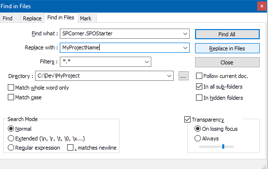

# SPOStarter
An almost empty, sandboxed WSP boilerplate for SharePoint Online.

The main purpose is to avoid this error from VS2015 when creating a project on a machine without SP server installed

## Usage
Based on [this](http://stackoverflow.com/a/28224878/4763804):

1. `$ git clone https://github.com/spcorner/SPOStarter.git MyProject`
2. `$ cd MyProject`
3. Remove .git folder within `MyProject`
4. `$ git init`
5. Rename `SPCorner.SPOStarter.sln` file to `MyProjectName.sln`
6. Rename `SPCorner.SPOStarter` folder to `MyProjectName`
7. Rename `SPCorner.SPOStarter.csproj` file within `MyProjectName` folder to `MyProjectName.csproj`
8. Find `SPCorner.SPOStarter` across the whole folder structure (with e.g. *Notepad++*) and replace with `MyProjectName` 

9. Open `MyProjectName.sln` in Visual Studio 
